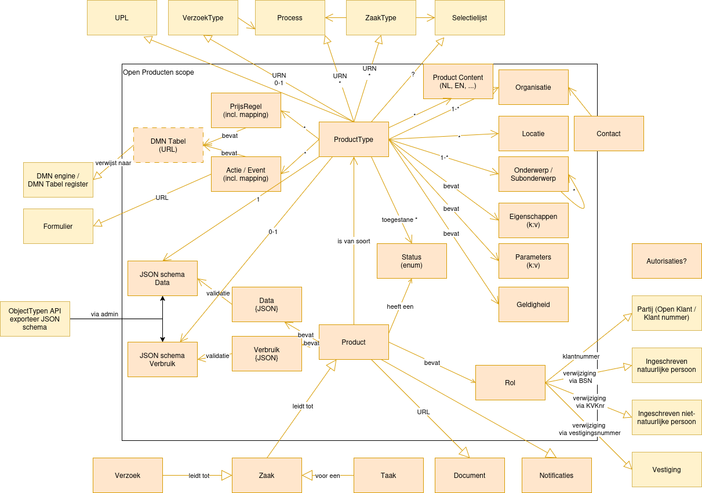

==================
open_producten
==================

:Version: 0.0.5
:Source: https://github.com/maykinmedia/open-producten
:Keywords: ``producten``

Plek voor gemeenten om product-typen en producten te beheren om ze te gebruiken in andere applicaties.
(`English version`_)

Ontwikkeld door `Maykin B.V.`_.

Introductie
===========

Open Producten is een applicatie waarin product typen en producten op een enkele plek kunnen worden beheerd.
Andere applicaties zoals Open Inwoner en Open Formulieren kunnen met Open Producten via een REST API integreren om bijvoorbeeld product typen informatie te tonen, producten aan te maken of om de actuele prijs van een product type op te halen.

Dit project zit op dit moment in de ontwikkelingsfase.

In Open Producten worden product typen en producten opgeslagen. Een product type is bijvoorbeeld een parkeervergunning en bevat alle relevante informatie zoals wat de regels zijn, hoe verschillende zones werken enz.
Een product is in dit voorbeeld een parkeervergunning van een persoon en bevat in dit geval het kenteken en de persoonsgegevens.

Informatiemodel
===============

API specificatie
================

|lint-oas| |generate-sdks| |generate-postman-collection|

==============  ==============  =============================
Versie          Release datum   API specificatie
==============  ==============  =============================
latest          n/a             `ReDoc <https://redocly.github.io/redoc/?url=https://raw.githubusercontent.com/maykinmedia/open-producten/main/src/openapi.yaml>`_,
                                `Swagger <https://petstore.swagger.io/?url=https://raw.githubusercontent.com/maykinmedia/open-producten/main/src/openapi.yaml>`_
==============  ==============  =============================

Er zijn twee manieren om te authenticeren met de API.

* Een api token kan worden aangemaakt in Open Producten admin -> Users -> Tokens.
* OpenId Connect kan worden ingesteld in the Open Producten admin -> Configuratie -> OpenID connect configuratie.

Ontwikkelaars
=============

|build-status| |coverage| |black| |python-versions|

Deze repository bevat de broncode voor open_producten. Om snel aan de slag
te gaan, raden we aan om de Docker image te gebruiken. Uiteraard kan je ook
het project zelf bouwen van de broncode. Zie hiervoor
`INSTALL.rst <INSTALL.rst>`_.

Open producten bestaat uit drie apps:

* product types
* products
* locations (& organisations)

Quickstart
----------

1. Download en start open_producten:

   .. code:: bash

      $ wget https://raw.githubusercontent.com/maykinmedia/open-producten/main/docker-compose.yml
      $ docker-compose up -d --no-build
      $ docker-compose exec web src/manage.py loaddata demodata
      $ docker-compose exec web src/manage.py createsuperuser

2. In de browser, navigeer naar ``http://localhost:8000/`` om de beheerinterface
   en de API te benaderen.

Links
=====

* `Docker image <https://hub.docker.com/r/maykinmedia/open-producten>`_
* `Issues <https://github.com/maykinmedia/open-producten/issues>`_
* `Code <https://github.com/maykinmedia/open-producten>`_

Licentie
========

Copyright © Maykin 2024

Licensed under the EUPL_

.. _`English version`: README.EN.rst

.. _`Maykin B.V.`: https://www.maykinmedia.nl

.. _`Objecttypen API`: https://github.com/maykinmedia/objecttypes-api

.. _`EUPL`: LICENSE.md

.. |build-status| image:: https://github.com/maykinmedia/open-producten/workflows/ci/badge.svg?branch=main
    :alt: Build status
    :target: https://github.com/maykinmedia/open-producten/actions?query=workflow%3Aci

.. |coverage| image:: https://codecov.io/github/maykinmedia/open-producten/branch/main/graphs/badge.svg?branch=main
    :alt: Coverage
    :target: https://codecov.io/gh/maykinmedia/open-producten

.. |black| image:: https://img.shields.io/badge/code%20style-black-000000.svg
    :alt: Code style
    :target: https://github.com/psf/black

.. |python-versions| image:: https://img.shields.io/badge/python-3.11%2B-blue.svg
    :alt: Supported Python version

.. |lint-oas| image:: https://github.com/maykinmedia/open-producten/workflows/lint-oas/badge.svg
    :alt: Lint OAS
    :target: https://github.com/maykinmedia/open-producten/actions?query=workflow%3Alint-oas

.. |generate-sdks| image:: https://github.com/maykinmedia/open-producten/workflows/generate-sdks/badge.svg
    :alt: Generate SDKs
    :target: https://github.com/maykinmedia/open-producten/actions?query=workflow%3Agenerate-sdks

.. |generate-postman-collection| image:: https://github.com/maykinmedia/open-producten/workflows/generate-postman-collection/badge.svg
    :alt: Generate Postman collection
    :target: https://github.com/maykinmedia/open-producten/actions?query=workflow%3Agenerate-postman-collection
